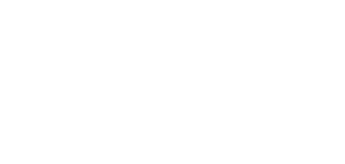
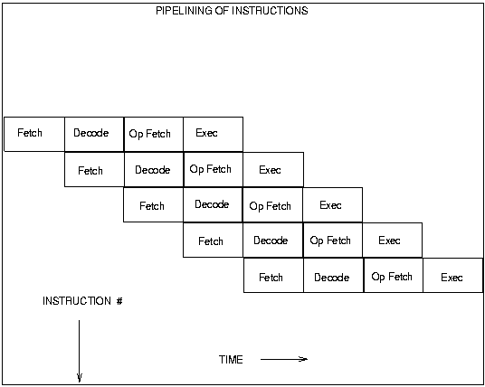

## RISC vs CISC

Roland Bergmann, Jakob Krause : Gruppe 3

!

## CISC

* Complex Instruction Set Computer
* Grosser Befehlssatz
* Spezalisierte Befehl (z.B Stringverarbeitung)

 http://de.wikipedia.org/wiki/Complex_Instruction_Set_Computer

!

## Prinzip 

Source : http://www.elektronik-kompendium.de

!

## CISC Idee

> "je mächtiger die Befehle einer CPU sind um so schneller diese”

- kurze Befehle sparen Speicher

Quelle : http://www.bernd-leitenberger.de/cisc-risc.shtml

!

## RISC

- Reduced Instruction Set Computer
- kleiner Befehlssatz
- keine komplexen Befehle

 Quelle : http://de.wikipedia.org/wiki/Reduced_Instruction_Set_Computing

!

## RISC

- Befehle sind fest verdrahtet
- viele Register
- wenige Transitoren => günstig

 Quelle : http://de.wikipedia.org/wiki/Reduced_Instruction_Set_Computing

!

## Beginn des Wettkampfes

- 1974: Intel führt den  8-bit 8080 processor, with 4,500 transistors ein

- 1975 “MOS Industries” bietet für 25$ Prozessor an den 6502

Quelle : http://www.computerworld.com/s/article/9091018/Timeline_A_brief_history_of_the_x86_microprocessor

!

## Chipnutzer 

- 6502 → Apple II, C64, Atari …
- 8080 → Schneider CPC, Tandy TRS-80...
- Beide sind erfolgreich...

!

## CISC Siegeszug

- Intel 8086 erscheint
- x86 Architektur
- 1986  Intel386 für IBM neue Reference

!

## Veränderungen

- C wurde populär
- Assembly nur für Spezialfälle genutzt

Quelle : http://cs.stanford.edu/people/eroberts/courses/soco/projects/risc/risccisc/

!

## C & CISC
- Compiler nutzen Spezialbefehle nicht
- 80% nutzen 20% der Befehl

Quelle : http://www.bernd-leitenberger.de/cisc-risc.shtml

!

## Speicher

- 1977 1 MB DRAM 5000$
- 1994 nur 6$

Quelle : http://cs.stanford.edu/people/eroberts/courses/soco/projects/risc/risccisc/

!

## Die Konsequenz

- RISC wurde wieder Interessant
- Motorola & Apple & IBM bauen Power PC Chip
- Hauptsächlich Workstations

!

## ARM
- heutigen sehr populären ARM Prozessoren führen ein Schatten da sein...

!

## CISC optimiert sich

!

## Warum ist RISC trotzdem schneller
- viele Register
- alle Befehle gleich lang
- Befehle müssen nicht interpretiert werden

!

## CISC heute
- x86 letzter “CISC” Prozessor mit CISC Architektur 
- CISC Befehle werden in RISC Operation übersetzt

!

## RISC heute
- ARM am populärsten
- Power Architectur in High-End Systemen, eingebettete Systeme...

!

## Zusammenfassung

- günstiger Speicher und die Hochsprachen
- moderen Prozessoren näheren sich RISC sowie CISC an

!

# Danke

